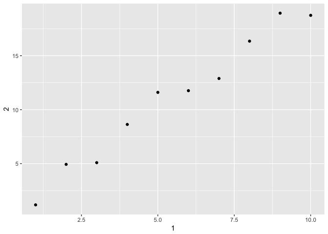

r4ds\_wrangle\_exercises\_10-11
================
Brandon Cox
9/25/2017

-   [Wrangle: Tibbles](#wrangle-tibbles)
    -   [10.5 Exercises](#exercises)
-   [Wrangle: Data Import](#wrangle-data-import)
    -   [11.2.2 Exercises](#exercises-1)
    -   [11.3.5 Exercises](#exercises-2)

Wrangle: Tibbles
----------------

### 10.5 Exercises

1. How can you tell if an object is a tibble? (Hint: try printing mtcars, which is a regular data frame).

    A tibble will show you the data types and the first 15 rows.

``` r
class(mtcars)
```

    ## [1] "data.frame"

``` r
print(mtcars)
```

    ##                      mpg cyl  disp  hp drat    wt  qsec vs am gear carb
    ## Mazda RX4           21.0   6 160.0 110 3.90 2.620 16.46  0  1    4    4
    ## Mazda RX4 Wag       21.0   6 160.0 110 3.90 2.875 17.02  0  1    4    4
    ## Datsun 710          22.8   4 108.0  93 3.85 2.320 18.61  1  1    4    1
    ## Hornet 4 Drive      21.4   6 258.0 110 3.08 3.215 19.44  1  0    3    1
    ## Hornet Sportabout   18.7   8 360.0 175 3.15 3.440 17.02  0  0    3    2
    ## Valiant             18.1   6 225.0 105 2.76 3.460 20.22  1  0    3    1
    ## Duster 360          14.3   8 360.0 245 3.21 3.570 15.84  0  0    3    4
    ## Merc 240D           24.4   4 146.7  62 3.69 3.190 20.00  1  0    4    2
    ## Merc 230            22.8   4 140.8  95 3.92 3.150 22.90  1  0    4    2
    ## Merc 280            19.2   6 167.6 123 3.92 3.440 18.30  1  0    4    4
    ## Merc 280C           17.8   6 167.6 123 3.92 3.440 18.90  1  0    4    4
    ## Merc 450SE          16.4   8 275.8 180 3.07 4.070 17.40  0  0    3    3
    ## Merc 450SL          17.3   8 275.8 180 3.07 3.730 17.60  0  0    3    3
    ## Merc 450SLC         15.2   8 275.8 180 3.07 3.780 18.00  0  0    3    3
    ## Cadillac Fleetwood  10.4   8 472.0 205 2.93 5.250 17.98  0  0    3    4
    ## Lincoln Continental 10.4   8 460.0 215 3.00 5.424 17.82  0  0    3    4
    ## Chrysler Imperial   14.7   8 440.0 230 3.23 5.345 17.42  0  0    3    4
    ## Fiat 128            32.4   4  78.7  66 4.08 2.200 19.47  1  1    4    1
    ## Honda Civic         30.4   4  75.7  52 4.93 1.615 18.52  1  1    4    2
    ## Toyota Corolla      33.9   4  71.1  65 4.22 1.835 19.90  1  1    4    1
    ## Toyota Corona       21.5   4 120.1  97 3.70 2.465 20.01  1  0    3    1
    ## Dodge Challenger    15.5   8 318.0 150 2.76 3.520 16.87  0  0    3    2
    ## AMC Javelin         15.2   8 304.0 150 3.15 3.435 17.30  0  0    3    2
    ## Camaro Z28          13.3   8 350.0 245 3.73 3.840 15.41  0  0    3    4
    ## Pontiac Firebird    19.2   8 400.0 175 3.08 3.845 17.05  0  0    3    2
    ## Fiat X1-9           27.3   4  79.0  66 4.08 1.935 18.90  1  1    4    1
    ## Porsche 914-2       26.0   4 120.3  91 4.43 2.140 16.70  0  1    5    2
    ## Lotus Europa        30.4   4  95.1 113 3.77 1.513 16.90  1  1    5    2
    ## Ford Pantera L      15.8   8 351.0 264 4.22 3.170 14.50  0  1    5    4
    ## Ferrari Dino        19.7   6 145.0 175 3.62 2.770 15.50  0  1    5    6
    ## Maserati Bora       15.0   8 301.0 335 3.54 3.570 14.60  0  1    5    8
    ## Volvo 142E          21.4   4 121.0 109 4.11 2.780 18.60  1  1    4    2

``` r
print(as_tibble(mtcars))
```

    ## # A tibble: 32 x 11
    ##      mpg   cyl  disp    hp  drat    wt  qsec    vs    am  gear  carb
    ##  * <dbl> <dbl> <dbl> <dbl> <dbl> <dbl> <dbl> <dbl> <dbl> <dbl> <dbl>
    ##  1  21.0     6 160.0   110  3.90 2.620 16.46     0     1     4     4
    ##  2  21.0     6 160.0   110  3.90 2.875 17.02     0     1     4     4
    ##  3  22.8     4 108.0    93  3.85 2.320 18.61     1     1     4     1
    ##  4  21.4     6 258.0   110  3.08 3.215 19.44     1     0     3     1
    ##  5  18.7     8 360.0   175  3.15 3.440 17.02     0     0     3     2
    ##  6  18.1     6 225.0   105  2.76 3.460 20.22     1     0     3     1
    ##  7  14.3     8 360.0   245  3.21 3.570 15.84     0     0     3     4
    ##  8  24.4     4 146.7    62  3.69 3.190 20.00     1     0     4     2
    ##  9  22.8     4 140.8    95  3.92 3.150 22.90     1     0     4     2
    ## 10  19.2     6 167.6   123  3.92 3.440 18.30     1     0     4     4
    ## # ... with 22 more rows

2. Compare and contrast the following operations on a data.frame and equivalent tibble. What is different? Why might the default data frame behaviours cause you frustration?

    You have to be more explicit with a tibble, which in turn give more reliability. Data frames can give unexpected results because it will give a result back if you partially match a column.

3. If you have the name of a variable stored in an object, e.g. var &lt;- "mpg", how can you extract the reference variable from a tibble?

``` r
tibbleCar <- as_tibble(mtcars)
var <- "mpg"
tibbleCar[var]
```

    ## # A tibble: 32 x 1
    ##      mpg
    ##    <dbl>
    ##  1  21.0
    ##  2  21.0
    ##  3  22.8
    ##  4  21.4
    ##  5  18.7
    ##  6  18.1
    ##  7  14.3
    ##  8  24.4
    ##  9  22.8
    ## 10  19.2
    ## # ... with 22 more rows

4. Practice referring to non-syntactic names in the following data frame by:
    
    - Extracting the variable called 1

``` r
annoying <- tibble(
  `1` = 1:10,
  `2` = `1` * 2 + rnorm(length(`1`))
)
annoying$`1`
```

    ##  [1]  1  2  3  4  5  6  7  8  9 10

``` r
annoying[1]
```

    ## # A tibble: 10 x 1
    ##      `1`
    ##    <int>
    ##  1     1
    ##  2     2
    ##  3     3
    ##  4     4
    ##  5     5
    ##  6     6
    ##  7     7
    ##  8     8
    ##  9     9
    ## 10    10

- Plotting a scatterplot of 1 vs 2

``` r
ggplot(annoying, aes(`1`, `2`)) +
  geom_point()
```

 

- Creating a new column called 3 which is 2 divided by 1

``` r
annoying <- mutate(annoying, `3` = `2` / `1`)
print(annoying)
```

    ## # A tibble: 10 x 3
    ##      `1`       `2`      `3`
    ##    <int>     <dbl>    <dbl>
    ##  1     1  1.177161 1.177161
    ##  2     2  4.929999 2.465000
    ##  3     3  5.090216 1.696739
    ##  4     4  8.629868 2.157467
    ##  5     5 11.602803 2.320561
    ##  6     6 11.760396 1.960066
    ##  7     7 12.891655 1.841665
    ##  8     8 16.350312 2.043789
    ##  9     9 18.945515 2.105057
    ## 10    10 18.741619 1.874162

- Renaming the columns to one, two and three

``` r
annoying <- rename(annoying, 
                   one = `1`,
                   two = `2`,
                   three = `3`)
print(annoying)
```

    ## # A tibble: 10 x 3
    ##      one       two    three
    ##    <int>     <dbl>    <dbl>
    ##  1     1  1.177161 1.177161
    ##  2     2  4.929999 2.465000
    ##  3     3  5.090216 1.696739
    ##  4     4  8.629868 2.157467
    ##  5     5 11.602803 2.320561
    ##  6     6 11.760396 1.960066
    ##  7     7 12.891655 1.841665
    ##  8     8 16.350312 2.043789
    ##  9     9 18.945515 2.105057
    ## 10    10 18.741619 1.874162

5. What does tibble::enframe() do? When might you use it?

``` r
help("enframe")
# enframe() converts named atomic vectors or lists to two-column data frames. For unnamed vectors, the natural sequence is used as name column.
enframe(c(a = 1, b = 2))
```

    ## # A tibble: 2 x 2
    ##    name value
    ##   <chr> <dbl>
    ## 1     a     1
    ## 2     b     2

6. What option controls how many additional column names are printed at the footer of a tibble?

``` r
?`tibble-package`
#tibble.max_extra_cols - Number of extra columns printed in reduced form. Default: 100.
```

Wrangle: Data Import
--------------------

### 11.2.2 Exercises

1. What function would you use to read a file where fields were separated with “|”?

        read_delim(file, delim = "|")

2. Apart from file, skip, and comment, what other arguments do read\_csv() and read\_tsv() have in common?

    file, col\_names, cal\_types, locale, na, quoted\_na, comment, trim\_ws skip, n\_max, guess\_max, progress

3. What are the most important arguments to read\_fwf()?

    col\_positions - because every field is in the same place in every line.

4. Sometimes strings in a CSV file contain commas. To prevent them from causing problems they need to be surrounded by a quoting character, like " or '. By convention, read\_csv() assumes that the quoting character will be ", and if you want to change it you’ll need to use read\_delim() instead. What arguments do you need to specify to read the following text into a data frame?

``` r
delimTest <- "x,y\n1,'a,b'"
read_delim(delimTest, delim = ",", quote = "'")
```

    ## # A tibble: 1 x 2
    ##       x     y
    ##   <int> <chr>
    ## 1     1   a,b

5.  Identify what is wrong with each of the following inline CSV files. What happens when you run the code?

``` r
#read_csv("a,b\n1,2,3\n4,5,6") - add c
read_csv("a,b,c\n1,2,3\n4,5,6")
```

    ## # A tibble: 2 x 3
    ##       a     b     c
    ##   <int> <int> <int>
    ## 1     1     2     3
    ## 2     4     5     6

``` r
#read_csv("a,b,c\n1,2\n1,2,3,4") - add value to c on row 1 and remove from row 2
read_csv("a,b,c\n1,2,3\n1,2,3")
```

    ## # A tibble: 2 x 3
    ##       a     b     c
    ##   <int> <int> <int>
    ## 1     1     2     3
    ## 2     1     2     3

``` r
#read_csv("a,b\n\"1") - no idea what is trying to be done here
#read_csv("a,b\n1,2\na,b") - everthing looks okay here?
read_csv("a,b\n1,2\na,b")
```

    ## # A tibble: 2 x 2
    ##       a     b
    ##   <chr> <chr>
    ## 1     1     2
    ## 2     a     b

``` r
#read_csv("a;b\n1;3") - use read_csv2
read_csv2("a;b\n1;3")
```

    ## Using ',' as decimal and '.' as grouping mark. Use read_delim() for more control.

    ## # A tibble: 1 x 2
    ##       a     b
    ##   <int> <int>
    ## 1     1     3

### 11.3.5 Exercises

1. What are the most important arguments to locale()?

    date\_names, date\_format, time\_format, decimal\_mark, grouping\_mark, tz

2. What happens if you try and set decimal\_mark and grouping\_mark to the same character? What happens to the default value of grouping\_mark when you set decimal\_mark to “,”? What happens to the default value of decimal\_mark when you set the grouping\_mark to “.”?

    You get an error stating that they must be different.

3. I didn’t discuss the date\_format and time\_format options to locale(). What do they do? Construct an example that shows when they might be useful.

    They let you create default formats for your locale.

4. If you live outside the US, create a new locale object that encapsulates the settings for the types of file you read most commonly.

    YAYA

5. What’s the difference between read\_csv() and read\_csv2()?

    The delimiter for `read_csv2` is a `;`. Some places use commas instead of decimmals so it helps with that.

6. What are the most common encodings used in Europe? What are the most common encodings used in Asia? Do some googling to find out.

    Europe - uses subset of ISO 8859. Asia - uses various different ones depending on the language/country. <https://en.wikipedia.org/wiki/Character_encoding>

7. Generate the correct format string to parse each of the following dates and times:

``` r
d1 <- "January 1, 2010"
parse_date(d1, "%B %d, %Y")
```

    ## [1] "2010-01-01"

``` r
d2 <- "2015-Mar-07"
parse_date(d2, "%Y-%b-%d")
```

    ## [1] "2015-03-07"

``` r
d3 <- "06-Jun-2017"
parse_date(d3, "%d-%b-%Y")
```

    ## [1] "2017-06-06"

``` r
d4 <- c("August 19 (2015)", "July 1 (2015)")
parse_date(d4, "%B %d (%Y)")
```

    ## [1] "2015-08-19" "2015-07-01"

``` r
d5 <- "12/30/14" # Dec 30, 2014
parse_date(d5, "%D")
```

    ## [1] "2014-12-30"

``` r
t1 <- "1705"
parse_time(t1, "%H%M")
```

    ## 17:05:00

``` r
t2 <- "11:15:10.12 PM"
parse_time(t2, "%I:%M:%OS %p")
```

    ## 23:15:10.12
